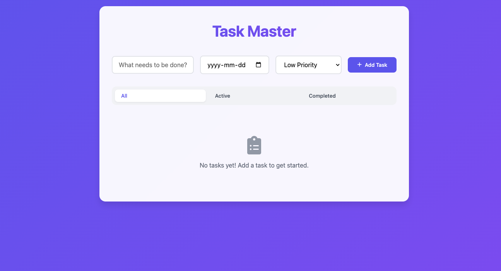
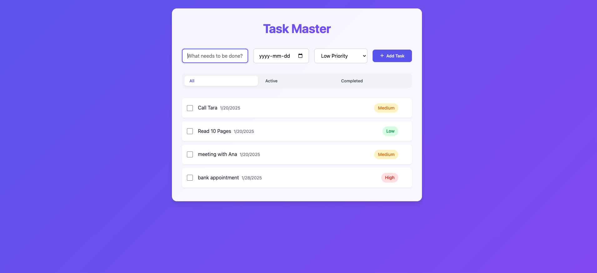
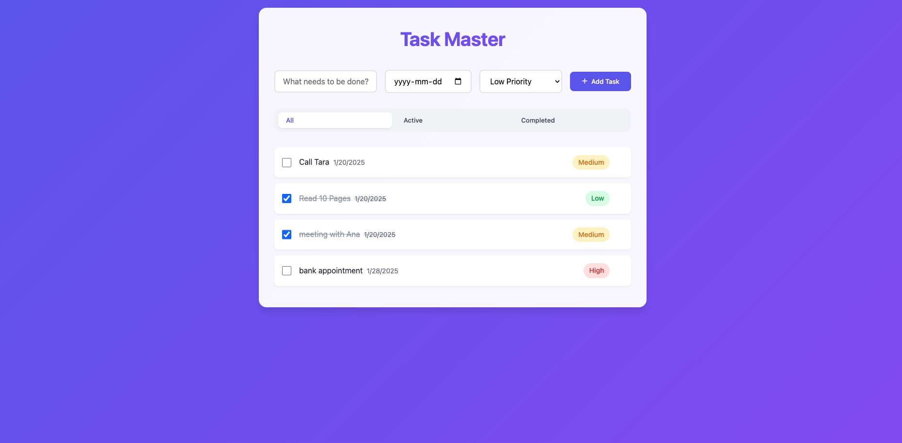
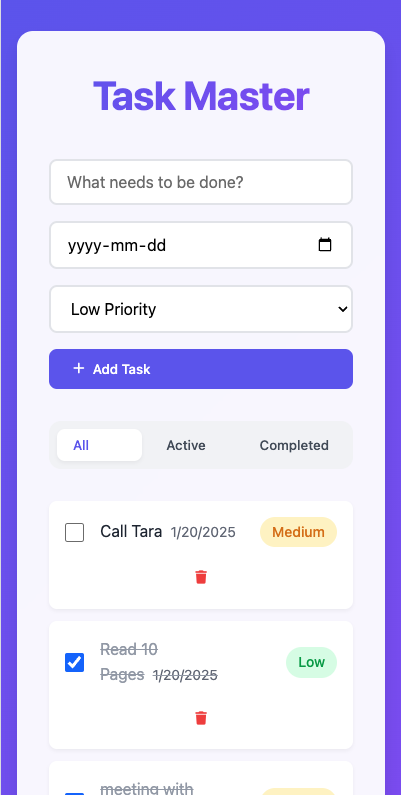

# Modern Task Master

A beautiful and responsive to-do list application built with vanilla JavaScript and modern CSS. This application allows you to manage your tasks with style and efficiency.

🌐 **Live Demo**: [Task Master App](https://minimal-task-master.netlify.app/)

## Features

- Add, complete, and delete tasks
- Set priority levels (Low, Medium, High)
- Add due dates to tasks
- Filter tasks by status (All, Active, Completed)
- Local storage persistence
- Responsive design
- Modern UI with smooth animations
- Cross-browser compatibility

## Technologies Used

- HTML5
- CSS3 (Modern features like CSS Grid, Flexbox, and CSS Variables)
- Vanilla JavaScript (ES6+)
- Local Storage API
- Font Awesome Icons

## Screenshots

### Clean Interface

*Clean and welcoming interface when no tasks are present*

### Task Management

*Adding new tasks with priority levels and due dates*

### Task Organization

*Tasks with different states and priority levels*

### Mobile Experience

*Responsive design for mobile devices*

## Getting Started

1. Clone the repository
2. Open `index.html` in your browser
3. Start managing your tasks!

## License

MIT License - feel free to use this project for personal or commercial purposes.
